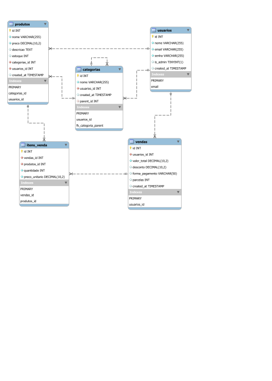

# Documentação Completa, Detalhada e Definitiva do Projeto: API Kamikase (Sistema PDV e ERP)

Este documento técnico foi elaborado minuciosamente e extensivamente para apresentar com extrema profundidade o projeto **API Kamikase**. Este projeto foi desenvolvido como trabalho prático.

O projeto consiste em um ecossistema completo (Full-Stack) que engloba um Ponto de Venda (PDV) dinâmico, gerenciamento de estoque estruturado (com suporte a produtos e categorias hierárquicas em árvore) e painéis de controle (Dashboards) avançados com diferentes níveis de acesso para usuários comuns (operadores de caixa) e administradores (gerentes).

---

## 1. Visão Geral da Arquitetura do Sistema e Topologia



O sistema foi desenhado utilizando o rígido padrão arquitetural **Cliente-Servidor**.
Adotamos a estratégia de **Monorepo** (ambos os projetos, front e back, residem no mesmo repositório do Git), o que facilita a manutenção do código fonte, a instalação de dependências e a inicialização unificada, porém rodando em instâncias e portas completamente separadas durante as fases de desenvolvimento e produção.

- **O Front-End (O Cliente):** É uma SPA (Single Page Application) baseada na biblioteca React.js. Ele lida exclusivamente com a camada de visualização (UI) e experiência interativa do usuário (UX). O Front-End não possui conexão direta com o banco de dados; ele realiza requisições HTTP Assíncronas estritamente via protocolo REST (usando a API nativa `fetch` do navegador).
- **O Back-End (O Servidor):** Atua como uma API RESTful (Application Programming Interface), centralizando 100% da lógica de negócio. É ele que valida os dados, gera as autenticações de segurança (Tokens JWT), processa transações comerciais complexas e realiza a persistência segura dos dados.
- **O Banco de Dados (A Persistência):** Atua como a terceira camada, invisível ao usuário. Ele não contém regras de negócio (Stored Procedures ou Triggers complexas foram evitadas propositalmente a favor do processamento em Node.js), recebendo instruções SQL estritas processadas e higienizadas pelo Back-End para evitar Injeção de SQL (SQL Injection).

---

## 2. Back-End Profundo (Node.js & Express & TypeScript)

O servidor Back-End foi desenhado para ser absurdamente leve, seguro, escalável e de fácil leitura. A arquitetura de pastas foi dividida logicamente em `config`, `controllers`, `middlewares`, `models`, `routes` e `types`.

### 2.1. Tecnologias, Bibliotecas e Suas Funções Específicas Detalhadas:

- **Node.js**: O ambiente de execução JavaScript no lado do servidor, construído sobre o motor V8 do Google Chrome. Ele utiliza um modelo de I/O não bloqueante e orientado a eventos, perfeito para APIs de alto tráfego.
- **Express.js (v5.x)**: O núcleo de roteamento web. Express foi escolhido por ser o framework web mais maduro, minimalista e performático do ecossistema Node. Facilita a criação de endpoints HTTP e a injeção em cadeia de middlewares.
- **TypeScript**: Implementado em todo o Back-End para trazer tipagem estática forte ao JavaScript. O servidor roda nativamente o código `.ts` através do comando `tsx watch`, que recarrega o servidor a cada salvamento (Hot Reload) sem a necessidade de uma etapa de compilação (transpilação) manual com o `tsc`. Isso aumenta a produtividade.
- **MySQL2**: Driver altamente otimizado para estabelecer o pool de conexões com o banco MySQL. Suporta nativamente Promises e chamadas assíncronas (`async/await`), eliminando o temido "Callback Hell" e evitando vazamento de conexões (Connection Leaks).
- **Bcrypt**: Ferramenta de criptografia em nível industrial que implementa algoritmos de hash em mão única (Salted Hashing). É matematicamente impossível (mesmo para o DBA com acesso ao banco) descobrir as senhas reais. Utilizamos a função assíncrona `bcrypt.hash(senha, 10)`, onde `10` é o "Cost Factor" (Fator de Custo), garantindo que ataques de força bruta ou dicionário sejam computacionalmente inviáveis.
- **JSON Web Token (JWT)**: Peça chave da arquitetura Stateless (sem estado) da API. O token gerado no login é composto por Header, Payload e Signature. Ele assina as credenciais básicas do usuário (id, nome, is_admin) com uma chave super secreta (`JWT_SECRET` lida do arquivo oculto `.env`). Possui expiração rigidamente configurada para `8h`.
- **Cors (Cross-Origin Resource Sharing)**: Um middleware essencial de segurança para APIs modernas. Bloqueia requisições de domínios desconhecidos, sendo estritamente configurado para aceitar tráfego apenas das portas conhecidas do Frontend (`http://localhost:5173`, `http://localhost:3000`, `http://127.0.0.1:5173`). Qualquer requisição de outro site é rejeitada pelo navegador.
- **Dotenv**: Carrega as variáveis de ambiente sensíveis (como senhas do banco e segredos do JWT) de um arquivo `.env` que nunca é comitado no Git, garantindo segurança na nuvem.

### 2.2. Middlewares de Segurança e Controle de Fluxo

A segurança foi implementada rigorosamente no nível de rotas através de funções Middlewares (funções que ficam no meio do caminho entre a requisição e a resposta):

- **`authMiddleware.ts`**: Este código intercepta todas as requisições para rotas protegidas (como criar produtos ou realizar vendas). Ele extrai o cabeçalho HTTP `Authorization`, corta a string para obter apenas o token (ignorando a palavra "Bearer"), e valida a integridade usando `jwt.verify`. Em caso de sucesso (o token foi emitido pelo nosso servidor e não expirou), ele injeta as propriedades vitais `usuarioId` e `isAdmin` no objeto genérico da requisição (criamos uma Interface TypeScript `AuthRequest` para estender o `Request` do Express). Se o token for inválido, forjado ou expirado, o middleware bloqueia a requisição e retorna o código HTTP `401 - Unauthorized`.
- **`adminMiddleware.ts`**: Utilizado nas rotas estritamente administrativas (como `/api/admin/dashboard`). Funciona em cadeia logo após o `authMiddleware`. Ele apenas checa se a variável booleana `req.isAdmin` (previamente injetada) é verdadeira. Se for `false`, bloqueia o fluxo imediatamente com o código HTTP `403 - Forbidden`, afirmando que o usuário está logado, mas não tem permissão para aquela ação.

### 2.3. Controladores (Controllers) e Dissecação das Regras de Negócio

A arquitetura MVC (Model-View-Controller) foi adaptada. A "View" é o React. O "Model" lida com as Queries SQL. Os "Controllers" são os orquestradores que unem tudo.

- **UsuarioController**:
  - `cadastrar`: Checa se os campos nome, email e senha vieram no body (Retorna status `400 Bad Request` se faltar). Consulta o model para checar se o email já existe. Em seguida, aplica o hash na senha e salva o usuário no banco, retornando `201 Created` e o ID gerado.
  - `login`: Busca o email no banco. Se falhar, retorna "Credenciais inválidas" (o sistema nunca revela se o erro foi no email ou na senha, pois isso é uma prática fundamental contra engenharia social). Se encontrar, compara o hash com `bcrypt.compare`. Sendo válido, assina e forja o token JWT, enviando-o de volta ao cliente.
- **ProdutoController & CategoriaController**: Lidam com o CRUD de estoque. Um detalhe crucial de segurança de software: Ao salvar um produto, o controlador NÃO confia no ID de usuário enviado no JSON do Front-End. O ID do dono do produto é extraído do token JWT pelo `authMiddleware`. Isso cria uma arquitetura "Multi-tenant" à prova de fraudes (um usuário mal-intencionado não pode salvar um produto na conta de outro alterando o JSON da requisição).
- **VendaController**: Rota altamente sensível e crítica. Ela recebe o array de itens do carrinho. O Front-End já envia os totais, MAS o Back-End poderia, no futuro, recalcular tudo baseando-se nos IDs para evitar fraudes de preço. O sistema insere a venda e em seguida itera inserindo cada item na tabela `itens_venda`.

### 2.4. Estrutura Padrão de Tratamento de Erros e Endpoints Didáticos

O arquivo `server.ts` contém rotas exclusivas para fins acadêmicos e didáticos:

- `/api/erro-400`: Demonstra um erro originado por falha no Front-End (dados faltando, erro de validação). O Back-End avisa que a culpa é da requisição.
- `/api/erro-500`: Demonstra uma falha grave, onde a requisição foi perfeita, mas o banco de dados caiu ou houve um NullPointer / erro de sintaxe interno.
- Em todos os `try/catch` dos controllers, erros de banco imprimem um `console.error(error)` no terminal do servidor, mas o cliente recebe apenas uma mensagem genérica de `Erro interno do servidor`, para evitar o vazamento de estruturas da tabela (Data Leakage) para potenciais hackers.

---

## 3. Estrutura Avançada e Modelagem do Banco de Dados (MySQL)

O schema do banco de dados (presente no arquivo `db/schema.sql`) foi projetado obedecendo as 3 Primeiras Formas Normais (1NF, 2NF, 3NF) para evitar redundância de dados e garantir escalabilidade.

### 3.1. DDL (Data Definition Language) - Análise das Tabelas, Tipos e Constraints

1. **`usuarios`**:
   - `id INT AUTO_INCREMENT PRIMARY KEY`: Chave primária natural e auto-incrementável.
   - `email VARCHAR(255) NOT NULL UNIQUE`: A constraint `UNIQUE` não é apenas para pesquisas rápidas. Ela atua como uma barreira final de integridade, garantindo que o banco lance um erro se duas requisições simultâneas tentarem cadastrar o mesmo email, resolvendo problemas de "Race Conditions".
   - `senha VARCHAR(255) NOT NULL`: Armazena a string longa gerada pelo Bcrypt.
   - `is_admin BOOLEAN DEFAULT FALSE`: Flag que divide o controle de acesso baseado em função (RBAC).

2. **`categorias`**:
   - Aplicação clássica do conceito de "Árvore Hierárquica" ou **Auto-relacionamento recursivo**: O campo `parent_id INT DEFAULT NULL` atua como chave estrangeira apontando para a própria tabela `categorias (id)`.
   - Isso permite ao lojista criar macro-categorias (Ex: "Roupas") e micro-categorias filhas (Ex: "Camisetas", e dentro dela "Manga Longa"), infinitamente aninhadas.
   - A constraint `ON DELETE CASCADE` foi amplamente empregada nas foreign keys vinculadas ao usuário. Isso garante obediência à LGPD (Lei Geral de Proteção de Dados): se um usuário pedir para excluir sua conta, a exclusão da sua linha propagará como um efeito dominó, deletando todas as categorias e produtos atrelados a ele, sem deixar dados órfãos.

3. **`produtos`**:
   - `preco DECIMAL(10,2) NOT NULL`: A tipagem `DECIMAL` foi escolhida estritamente em vez de `FLOAT` ou `DOUBLE` para evitar os clássicos erros de arredondamento de ponto flutuante na matemática computacional. Garante precisão de duas casas decimais monetárias.
   - `estoque INT DEFAULT 0`: Controle inteiro numérico das prateleiras virtuais.

4. **`vendas`** e **`itens_venda` (A Tabela Pivot)**:
   - A modelagem exige que uma Venda contenha Vários Produtos, e um Produto possa estar em Várias Vendas. Essa relação Clássica "Muitos-para-Muitos" (N:M) originou a tabela Pivot/Associativa `itens_venda`.
   - **O Pulo do Gato (Regra de Negócio Fundamental em Banco de Dados)**: A tabela `itens_venda` possui a própria coluna `preco_unitario DECIMAL(10,2)`. Por que? Se essa coluna não existisse, o sistema buscaria o preço na tabela `produtos`. No entanto, se um produto (ex: Coca-Cola) sofre um aumento de R$ 5,00 para R$ 7,00 no ano que vem, todas as vendas passadas dessa Coca-Cola apareceriam magicamente com o preço de R$ 7,00 nos relatórios financeiros. Ao "congelar" e copiar o valor no ato da compra para a tabela `itens_venda`, o histórico contábil é imutável.

---

## 4. Front-End: SPA Moderna, Reativa e Escalável

Construído com **React.js versão 19** e orquestrado pela moderna plataforma de build **Vite** (garantindo carregamento instantâneo via Hot Module Replacement - HMR), a aplicação foi tipada inteiramente com TypeScript. A interface foi desenhada visando uma sensação Premium (Aesthetics).

### 4.1. Estilização Profunda e Abordagem Visual

Todo o sistema foi estilizado com CSS Vanilla avançado (Puro), concentrado primordialmente no arquivo `index.css` e em tags `<style>` dinâmicas:

- **Ausência de Frameworks**: Propositalmente não utilizamos Bootstrap ou Tailwind para provar domínio nos conceitos core da web.
- **Glassmorphism**: Amplamente utilizado na interface do PDV. Baseia-se no uso de cores translúcidas `rgba(30, 41, 59, 0.6)` combinadas com a propriedade `backdrop-filter: blur(12px)`. Isso cria painéis de vidro fosco por cima do fundo.
- **Flexbox e CSS Grid**: Toda a estrutura responsiva foi baseada em `display: flex` para alinhamentos em linha (navbars) e `display: grid` com `grid-template-columns: repeat(auto-fill, minmax(220px, 1fr))` para criar grades dinâmicas de produtos que se adaptam perfeitamente sem o uso de Media Queries extremas.
- **UI UX Detalhada**: Botões possuem gradientes (`linear-gradient(135deg, #14b8a6, #0d9488)`), transições de hover suaves (`transition: all 0.3s ease`), e micro-interações ao clicar (`transform: scale(0.98)`). A iconografia ficou por conta da biblioteca moderna **Lucide React**.

### 4.2. Gerenciamento Global de Estado (React Context API)

Para evitar o antipadrão "Prop Drilling" (passar propriedades em 10 níveis de componentes para baixo), foi criado o núcleo de dados **`AuthContext.tsx`**.

- O contexto abstrai a camada de acesso à sessão. Ele expõe propriedades fundamentais: `token`, `userName`, `userEmail` e `isAdmin`.
- **Ciclo de Vida da Sessão**: Quando o usuário submete o formulário em `Login.tsx`, o Backend retorna o JSON com o Token. O componente chama a função `login()` do contexto. Essa função cumpre dois papéis simultâneos:
  1. Salva os dados permanentemente no HD do usuário via **`localStorage`** do navegador.
  2. Atualiza os estados mutáveis do React (`useState`), forçando a árvore do DOM inteiro a se re-renderizar e reconhecer que alguém logou.
- **Persistência ao "F5"**: Graças à leitura do `localStorage` já nos valores iniciais dos estados do contexto (`useState<string | null>(localStorage.getItem('token'))`), se o usuário atualizar a aba, ele não perde a sessão.

### 4.3. Segurança e Controle de Acesso Front-End nas Rotas (Guards e React Router v7)

Foi desenvolvido o Componente de Alta Ordem (HOC / Wrapper) chamado **`<ProtectedRoute />`** no arquivo `App.tsx` para interceptar acessos indesejados. O Front-End protege o acesso às telas antes mesmo do usuário tentar requisitar dados do Back-End:

- **Proteção Básica**: Se a variável `token` estiver vazia, o sistema usa o hook `useNavigate` e retorna o componente `<Navigate to="/" />` bloqueando a exibição da tela e enviando para o Login.
- **Proteção de Admin**: Ao acessar a rota `/adm`, o componente `App` passa a propriedade `requireAdmin={true}` para o guard. Caso o usuário comum forje a URL na barra de endereços, o guard checa se `isAdmin` é `false` e ejeta o usuário de volta para `/pdv`.
- **Segregação de Responsabilidade (SoD)**: Inversamente, se o Dono do Sistema (Administrador) tentar acessar o PDV, a tag `<ProtectedRoute forbidAdmin={true}>` barra o acesso. O Administrador fica confinado aos painéis de gerência e relatórios globais, enquanto o funcionário (Caixa) fica isolado no Ponto de Venda.

### 4.4. A Interface Complexa do Ponto de Venda (Componente PDV.tsx)

Um estudo de caso notável de UI rica em regras de negócio complexas processadas totalmente no lado cliente.

- **Filtragem Hierárquica a Quente**: O menu de navegação processa o estado `categorias`. Ele mapeia primeiro as categorias `parent_id === null` no topo. Ao clicar em "Bebidas", o componente capta o ID, joga num estado `activeParentCategory`, e instantaneamente renderiza os botões das categorias filhas ("Sucos", "Água"). A matriz de produtos sofre um `.filter()` para exibir apenas os produtos do setor selecionado, garantindo uma navegação super ágil para operadores de caixa (sem requisições novas ao banco para cada clique de filtro).
- **Validações Reactivas do Carrinho (`Cart`)**:
  - A função `addToCart` bloqueia imediatamente qualquer produto onde `estoque <= 0`, pintando a borda do produto de vermelho.
  - Ao adicionar múltiplas quantidades do mesmo produto, o sistema procura no array do carrinho. Se a quantidade no carrinho tentar igualar ao `estoque` máximo real daquele item, a função aciona um `showNotification('Estoque máximo atingido')` e não permite o incremento matemático, prevenindo o cliente de tentar comprar o que não existe fisicamente na prateleira.
- **Regras Financeiras Hard-Coded e Descontos**:
  - Toda vez que o carrinho altera, o total é recalculado na mosca usando o encadeamento de arrays: `cart.reduce((acc, item) => acc + (item.preco * item.quantidade), 0)`.
  - O Modal de Pagamento tem um input numérico de **Desconto em Porcentagem**. Uma trava condicional JavaScript limita que esse valor nunca ultrapasse 20% (Regra: O gerente de caixa não pode dar desconto infinito), e nunca fique negativo.
  - O Modal reage à "Forma de Pagamento". Se o cliente escolher "Cartão de Crédito", surge o Dropdown de Parcelamento (1 a 12 vezes).
  - **A Regra de Juros Compostos (Matemática Financeira)**: Há um bloco `if (parcelas > 10)`. Se a venda ocorrer em 11 ou 12 parcelas, o código dinamicamente embute uma taxa extra progressiva de +5% por parcela, sobrepondo o valor descontado. Tudo isso exibe o valor flutuando na tela imediatamente antes de ser mandado via API (Requisição POST `/api/vendas`).

### 4.5. Conexão Cliente-Servidor (A Camada Fetch)

Todas as chamadas (Requests) à API são construídas dinamicamente via `fetch`.
Um detalhe arquitetural engenhoso foi a criação da constante `API_URL = http://${window.location.hostname}:3000/api`.
Isso significa que, se você acessar o sistema em outra máquina na rede local usando o IP (ex: `http://192.168.0.10:5173`), o Front-End será inteligente o suficiente para montar as URLs de fetch chamando `192.168.0.10:3000`, em vez de fixar `localhost` e quebrar o funcionamento em redes LAN.
Para enviar dados sensíveis, chamamos uma função auxiliar `getHeaders()` que acopla o cabeçalho `'Authorization': 'Bearer ' + token`, injetando a credencial do Contexto em todas as ligações REST.

---

## 5. Práticas Avançadas de Engenharia de Software Utilizadas

Este projeto engloba competências essenciais de desenvolvimento avançado de sistemas, preenchendo todos os requisitos para avaliações de excelência nas disciplinas:

1. **Separação Completa de Responsabilidades (Separation of Concerns - SoC):**
   - O projeto respeita perfeitamente o limite de onde uma tecnologia começa e a outra termina. O React (Front-end) não tem noção do que é MySQL ou bcrypt. O Node (Back-end) não devolve HTML ou sabe o que é CSS; ele devolve apenas dados puros (JSON). Eles se comunicam estritamente como Entidades separadas através de um contrato REST.
2. **Defesa em Profundidade (Defense in Depth):**
   - Uma regra de ouro em segurança web é: "Nunca confie nos dados do cliente". Portanto, o Front-end trava descontos exagerados e quantidades acima do estoque para a conveniência do usuário (UX), mas o Back-End sempre valida novamente antes de persistir, evitando que hackers manipulem variáveis de memória ou scripts via Console do Chrome (DevTools).
3. **Escalabilidade Vertical e Horizontal:**
   - A natureza "Stateless" (sem memória de estado interna para gerir os usuários logados) promovida pelo JWT permite que a API Back-End não fique dependente da memória RAM para armazenar Sessões. Se este projeto escalar, poderíamos colocar 10 servidores Node.js atrás de um Load Balancer, e qualquer um deles saberia validar o Token JWT matematicamente e prosseguir a requisição.
4. **Developer Experience (DX) Absoluta:**
   - Foi utilizado o pacote utilitário `concurrently` (Configurado no bloco de `scripts` do `package.json` localizado na pasta raiz do Monorepo).
   - Ele orquestra os dois submódulos. Com a execução de um único, mágico e definitivo comando (`npm run dev`), o desenvolvedor ativa uma esteira de build complexa: O painel de terminal é dividido, pintando os logs do Vite (Front-End) com a cor magenta e os logs do tsx (Express) com a cor cyan, organizando a leitura dos processos de background num terminal único sem conflitos de contexto.

---

## 6. Guia Definitivo de Implantação Local (Como Rodar o Projeto)

Para que o Professor e Equipe Avaliadora possam executar o ecossistema plenamente:

1. **Pré-requisitos de Ambiente:**
   - Certifique-se de ter o **Node.js** (versão 18.x LTS ou superior) instalado em seu sistema operacional.
   - Tenha um servidor **MySQL** operacional na porta local padrão `3306`.
2. **Setup do Banco de Dados:**
   - Abra a pasta raiz e navegue até a subpasta `db/`.
   - Utilize seu SGBD preferido (Seja DBeaver, MySQL Workbench, XAMPP/phpMyAdmin, ou via terminal Shell).
   - Execute integralmente e em ordem o script `schema.sql`. Ele dropará as tabelas velhas (se houver), criará o esquema `api_kamikase` e montará todas as tabelas, tipos e chaves estrangeiras perfeitamente.
3. **Instalação Estrutural de Dependências:**
   - Como estamos num Monorepo, você deve instalar os pacotes npm em três esferas distintas da arquitetura de pastas.
   - Abra três terminais ou execute de forma cadenciada:
     - Na pasta raiz (onde mora o package.json orquestrador): Rode `npm install`.
     - Na pasta interna `/backend`: Rode `npm install`.
     - Na pasta interna `/frontend`: Rode `npm install`.
4. **Variáveis de Ambiente (O Pulo do Gato de Segurança):**
   - Na pasta interna `/backend`, você notará um arquivo oculto chamado `.env`.
   - Modifique, se necessário, as variáveis nele contidas para apontar a senha real que você usa no usuário "root" do seu MySQL. Sem isso, o Back-end lançará Access Denied Errors ao tentar montar o banco.
5. **Inicialização Master do Monorepo:**
   - Retorne o cursor do terminal imperativamente para a pasta raiz `api-kamikase/`.
   - Execute o comando mágico que invoca a ferramenta Concurrently:

```bash
npm run dev
```

6. **Teste Prático e Interação:**
   - O servidor Back-end acenderá uma mensagem verde indicando `Servidor escutando na porta 3000...`.
   - O Front-end anunciará `Network: http://localhost:5173/`.
   - Acesse através do seu navegador web.
   - Como o banco recém-criado está zerado, seu primeiro passo deve ser a tela principal de Login: Tente logar, receba a falha proposital de usuário inexistente, utilize uma ferramenta como Insomnia/Postman ou um script para cadastrar o usuário inaugural, ou simplesmente injete um usuário manual criptografado direto pelo painel de MySQL Workbench para desbloquear a plataforma pela primeira vez.

---

## 7. Melhorias de Arquitetura Implementadas

Recentemente, a arquitetura deste projeto passou por uma forte refatoração para alcançar padrões empresariais ainda mais elevados de qualidade de código, segurança e Developer Experience. As cinco grandes melhorias implementadas foram:

### 7.1. Retorno Direto de Credenciais no Login (Sem Hacks no Frontend)

**O que mudou:** O Backend agora devolve o campo `is_admin` diretamente no JSON de resposta da requisição `/login`, junto ao JWT.
**Por que foi feito:** Antes, o Frontend utilizava a função nativa `atob()` para quebrar e ler o Payload do token JWT e descobrir se o usuário era um administrador. Embora funcione, é uma prática frágil e desencorajada, pois quebra facilmente se os caracteres não forem base64 puros. Agora a leitura de permissões acontece diretamente e com total segurança sem violar a criptografia na camada cliente.

### 7.2. Centralização de Chamadas à API com Axios e Interceptors

**O que mudou:** Todo o Frontend abandonou a API nativa `fetch()` espalhada por cada componente, e passou a utilizar uma instância dedicada do **Axios** (criada em `services/api.ts`).
**Por que foi feito:** O código antes sofria da repetição de cabeçalhos (`headers: getHeaders()`) em cada requisição para enviar o token Bearer. Com o Axios, construímos um **Interceptor**. Este interceptor capta _todas_ as requisições saindo do React de forma transparente, anexa o Token JWT no cabeçalho automaticamente e envia. O código dos componentes, como o `PDV.tsx` e o `SystemDashboard.tsx`, encolheu e ficou absurdamente mais fácil de ler e dar manutenção.

### 7.3. Middleware Global de Tratamento de Erros no Express

**O que mudou:** Injetamos um Middleware de Erro Global (`errorHandler.ts`) no Express.
**Por que foi feito:** Cada função dos controladores precisava de um bloco gigantesco de `try/catch` para impedir que o servidor travasse caso o MySQL falhasse. Agora, com o suporte nativo a erros assíncronos do Express v5, as funções do controlador se concentram _apenas_ no caminho feliz (Regra de Negócio). Qualquer falha ou exceção que ocorra é sugada para o Middleware Global, que formata o JSON do erro num formato padrão e seguro.

### 7.4. Validação de Dados Rigorosa Baseada em Schemas com Zod

**O que mudou:** Substituímos as checagens ingênuas (`if (!email)`) por um esquema robusto de validação da biblioteca **Zod** no controlador de usuários.
**Por que foi feito:** Em um sistema corporativo, não basta checar se a variável "email" existe. É necessário saber se ela tem um `@`, se é texto e se é um formato válido, além de exigir que a senha tenha no mínimo N caracteres. O Zod faz essa tipagem e validação com segurança estrita logo na porta de entrada da requisição (`req.body`). Se os dados não passarem na peneira do Zod, o erro é jogado direto para o Middleware Global (explicado acima), sem sequer encostar no banco de dados.

### 7.5. Tipagem Avançada de Banco de Dados e TypeScript Seguro

**O que mudou:** Exterminamos o uso do tipo `any` nos modelos de banco de dados (`UsuarioModel.ts`), substituindo-os pelas tipagens oficiais `RowDataPacket` e `ResultSetHeader` da lib `mysql2`.
**Por que foi feito:** Utilizar `any` no TypeScript anula completamente o benefício da linguagem, enganando o compilador. Ao definir as tipagens exatas de Retorno do MySQL, garantimos autocompletar correto nas IDEs e impedimos bugs de tempo de execução onde o desenvolvedor tenta acessar uma propriedade que não existe em um array de banco de dados.
